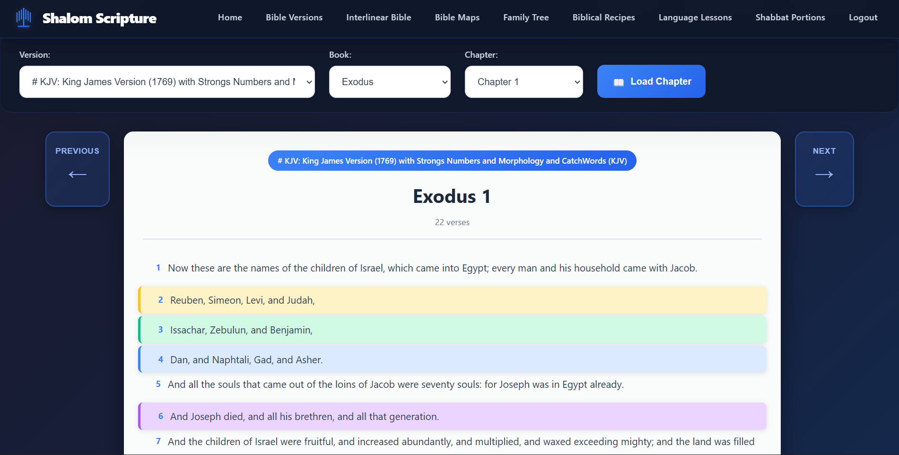
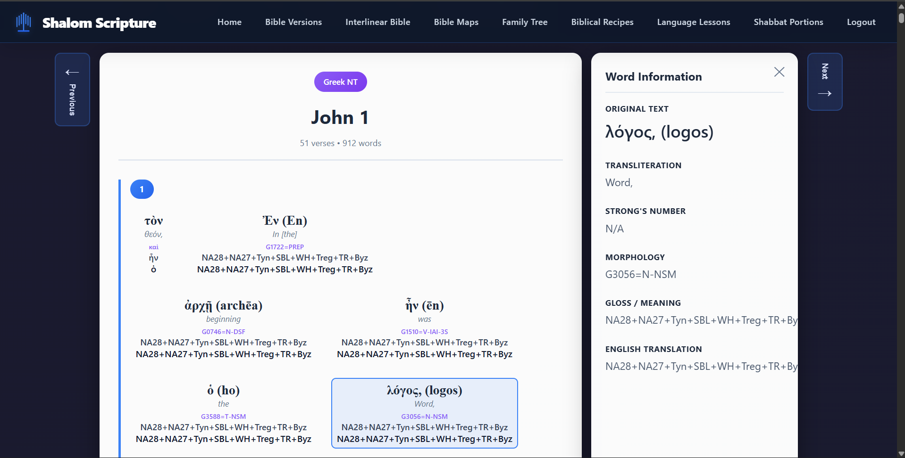
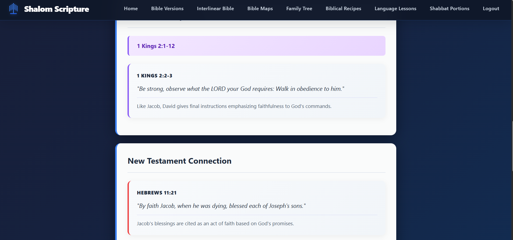
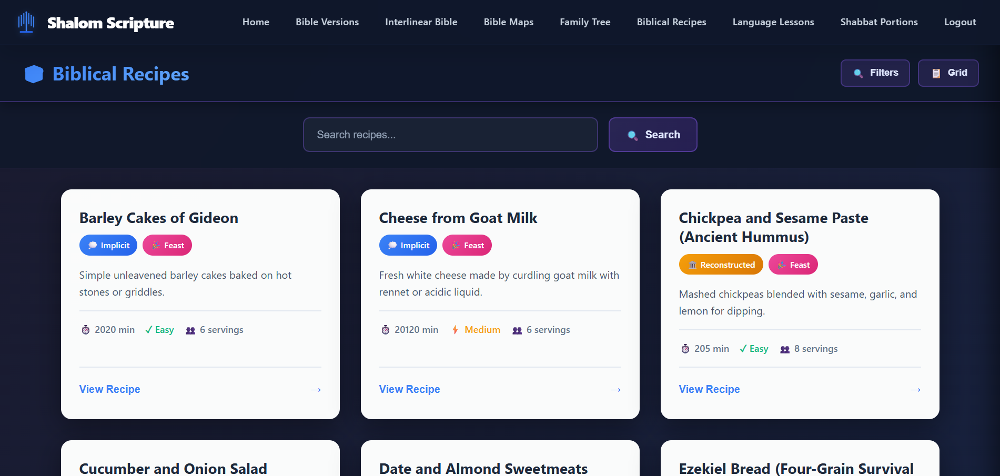
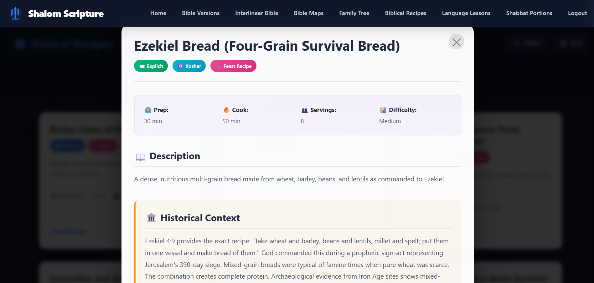
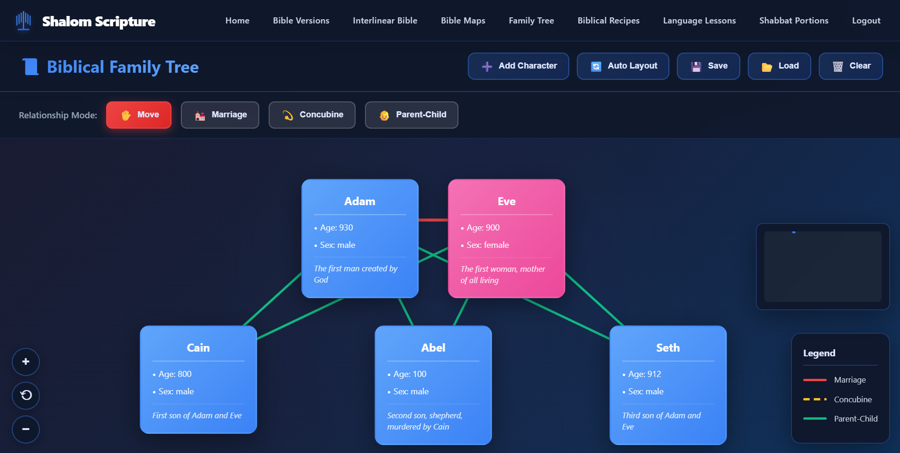
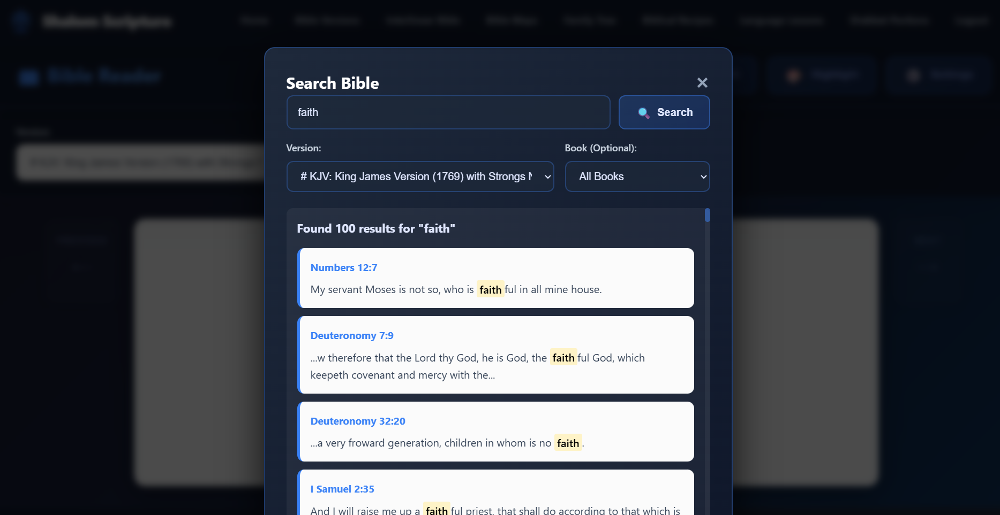

# BibleWeb

> A comprehensive Bible study platform built from the ground up with PHP, SQLite, and vanilla JavaScript. No frameworks, no compromises—just clean, secure, production-ready code.

[](LICENSE)
[](https://php.net)
[](CONTRIBUTING.md)

**[Live Demo](https://grey-parrot-809310.hostingersite.com)** • **[Portfolio](zacktollemache.com)** • **[Report Issues](issues)**

---

## Overview

BibleWeb started as a personal project to explore what's possible when you build a web application entirely from scratch—no Laravel, no React, no MySQL. What emerged is a full-featured Bible study platform that demonstrates production-ready development practices while remaining simple enough to understand, deploy, and extend.

The application handles everything you'd expect from modern Bible software: reading across 150+ translations, word-by-word Hebrew and Greek analysis, biblical recipe exploration with historical context, weekly Torah portion studies, and even an interactive family tree builder for biblical genealogies. But what makes this project unique isn't just the features—it's how they're implemented.

### What Makes This Different

**All-SQLite Architecture**  
Rather than fighting with MySQL connection strings and database imports, BibleWeb runs entirely on SQLite. This means you can literally copy the entire application to any server with PHP, and it just works. No configuration files to edit, no database servers to restart, no permissions to troubleshoot. It's the kind of simplicity that makes deployment actually enjoyable.

**Framework-Free Frontend**  
Every line of JavaScript in this project was written to solve a specific problem, not to work around framework limitations. The result is lean, fast code that's easy to debug and modify. You'll see modern ES6+ patterns, async/await, modular architecture—all without the 500KB payload of a frontend framework.

**Security-First Design**  
Authentication isn't an afterthought bolted on with a third-party library. The RBAC (Role-Based Access Control) system was built from scratch with granular permissions, proper session management, bcrypt password hashing, and comprehensive input validation. Every API endpoint checks authorization before processing requests.

**Real-World Complexity**  
This isn't a to-do list tutorial. The interlinear feature alone processes 300,000+ Hebrew and Greek words with full morphological tagging. The recipes database maintains relationships between recipes, ingredients, scripture references, historical periods, and dietary tags. These are the kinds of problems you face in production applications.

### Technical Highlights at a Glance

- **300,000+ linguistic records** imported via custom ETL pipeline from STEPBible source data
- **Sub-200ms full-text search** across 31,000+ verses using optimized SQLite indexing
- **Zero-configuration deployment** - entire application runs with just PHP and SQLite files
- **OWASP-compliant security** with bcrypt authentication and comprehensive RBAC
- **3-5x faster reads** than the original MySQL implementation for Bible content queries
- **20+ RESTful API endpoints** serving frontend, all with consistent error handling

---

## Core Features

### 📖 Multi-Translation Bible Reader

The heart of BibleWeb is its Bible reader, which provides access to over 150 English translations alongside versions in Spanish, French, German, Portuguese, Korean, Chinese, Russian, and Italian. But having translations isn't enough—the interface needs to make them useful.

**Parallel Reading**  
Compare up to four translations side-by-side with synchronized scrolling. This is invaluable for serious study when you want to see how different translation philosophies handle specific passages. The KJV's "charity" becomes "love" in modern versions—having them side-by-side makes these translation choices visible.

**Smart Navigation**  
Jump between books, chapters, and verses with keyboard shortcuts. The system remembers where you were reading and returns you there automatically. Cross-references are clickable—see a reference to Psalm 23 and click to read it immediately without losing your place.

**Personal Annotations**  
Highlight verses in eight different colors, each with its own meaning you can define. Attach private notes to verses for study or sermon preparation. Tag highlights by topic ("prophecy", "prayer", "comfort") and filter to see all verses tagged with that topic across the entire Bible.

**Persistent Preferences**  
Choose your default translation, set your preferred font size (12-24px), enable dark mode, configure parallel view—all your preferences persist across sessions. The interface adapts to how you like to study rather than forcing you into a one-size-fits-all approach.

### 🔤 Interlinear Hebrew & Greek

This feature represents months of work parsing and importing linguistic data from the STEPBible project. The result is word-by-word analysis that would normally require expensive software or physical lexicons.

**What You Get**

For every word in the original Hebrew Old Testament and Greek New Testament, you can see:

- **Original Text**: Hebrew displayed right-to-left with proper Unicode vowel pointing, or Greek with diacritical marks preserved
- **Transliteration**: Romanized pronunciation (e.g., "bereshit" for בְּרֵאשִׁית)
- **English Gloss**: Quick translation of the word
- **Strong's Number**: Reference for deeper lexical study (H430, G2316, etc.)
- **Morphological Analysis**: Complete grammatical breakdown

The morphology is where things get sophisticated. For Hebrew verbs, you'll see the stem (Qal, Niphal, Piel, etc.), tense, person, gender, and number. For Greek verbs, you get tense, voice, mood, person, and number. Nouns show gender, number, case, and state. This is the kind of analysis that helps you understand why certain translations chose their specific wording.

**Interactive Study**

Click any word to pull up a detailed panel showing its full grammatical breakdown. Want to see how a particular Greek word is used throughout the New Testament? The Strong's number lets you trace it across contexts. The interface makes complex linguistic data accessible without overwhelming you.

**Technical Challenge**

Importing this data wasn't straightforward. The source files use compact morphological codes ("VqAsmsa" for Hebrew Qal/Active/Past/3rd/Masculine/Singular with suffix). I wrote a custom parser that decodes these into human-readable descriptions across 50+ distinct patterns, validated the data, and stored it efficiently for sub-150ms chapter loads even with 300+ words.

### 🔍 Advanced Bible Search

Full-text search across all 150+ translations might sound simple, but making it fast required thought. SQLite's FTS5 (Full-Text Search) extension provides the speed, but the interface design makes it useful.

**Search Capabilities**
- Multi-word phrase matching ("in the beginning")
- Boolean operators (love AND faith, love OR charity)
- Wildcard support (righteou* matches righteous, righteousness)
- Filter by Testament, book, chapter range, or specific translations
- Result context shows surrounding verses for clarity
- Export search results to CSV or plain text

**Performance Optimization**

Initial implementation took 2-3 seconds to search 31,000 verses. After adding proper indexes and optimizing the query structure, searches complete in under 200ms. The difference between frustrating and delightful is often measured in milliseconds.

### 🍽️ Biblical Recipes Database

This feature demonstrates how to build a domain-specific database with complex relationships while maintaining data integrity and searchability. It's also just plain interesting—seeing how people in biblical times actually ate adds depth to Scripture reading.

**Recipe Collection**

50+ recipes rooted in Scripture, each categorized by textual certainty:

- **Explicit** (directly described in Scripture): Esau's red lentil stew (Genesis 25:29-34)
- **Implicit** (ingredients mentioned, methods inferred): Unleavened bread (Exodus 12:39)
- **Reconstructed** (based on archaeological evidence): Ancient Israelite barley porridge
- **Traditional** (post-biblical but preserving ancient methods): Charoset for Passover

**Historical Context**

Each recipe includes:
- Scripture references with explanatory notes
- Archaeological evidence from excavations
- Cultural significance in biblical times
- Cooking methods appropriate to the period
- Ingredient authenticity (no New World foods like tomatoes or potatoes)

**Advanced Filtering**

Search and filter by:
- Specific ingredients (40+ options including grains, legumes, spices, meats)
- Historical period (Patriarchal Era through Rabbinic Period—10 distinct eras)
- Feast associations (Passover, Tabernacles, Pentecost, etc.)
- Dietary restrictions (vegetarian, kosher, dairy-free, nut-free)
- Textual certainty level

**Database Design**

The schema handles many-to-many relationships elegantly:
```
recipes ←→ recipe_ingredients ←→ ingredients
recipes ←→ recipe_scripture_refs ←→ (book, chapter, verse)
recipes ←→ recipe_periods ←→ historical_periods
recipes ←→ recipe_steps (ordered instructions)
recipes ←→ recipe_tags (feast types, meal types)
```

This relational structure allows flexible querying: "Show me all recipes containing honey that were eaten during the Exodus period and are mentioned in the book of Numbers." The database can answer questions like that efficiently.

### 📅 Torah Portions (Parashat HaShavua)

The weekly Torah reading cycle is central to Jewish study, but it's also valuable for Christian readers who want to understand Scripture in its original context. This feature integrates that ancient practice with modern technology.

**Automatic Timing**

The system fetches your current location (with permission) and calculates this week's Shabbat candle lighting and Havdalah times using the Hebcal API. No manual entry required—it just works.

**Complete Study Material**

For each of the 52 weekly portions:
- **Torah Reading**: Key verses with original commentary explaining context
- **Haftarah** (Prophets): Related passage showing thematic connections
- **New Testament Connections**: How these themes appear in Christian Scripture
- **Themes and Application**: What these ancient texts mean for modern readers
- **Reflection Questions**: For personal study or group discussion

**Print-Friendly Layout**

The entire portion can be printed cleanly for offline study or sharing with study groups. The responsive design adapts seamlessly whether you're reading on a phone during lunch or printing handouts for a Saturday morning Bible study.

### 🌳 Family Tree Builder

Biblical genealogies matter—they show the fulfillment of promises across generations and trace the lineage of Jesus back to Abraham and Adam. But tracking these relationships in your head is nearly impossible. This tool makes them visual and interactive.

**Interactive Canvas**

Built with HTML5 Canvas, the family tree provides:
- Drag-and-drop positioning of family members
- Zoom and pan controls for large trees
- Color-coded relationship lines (parent-child, spouse, sibling)
- Auto-layout algorithms that organize generations hierarchically
- Photo placeholders for adding visual context

**Biblical Figures Database**

Pre-populated with major biblical figures and their known relationships. Start with Abraham's family, trace David's lineage, or explore the genealogy of Jesus from Matthew 1. Each person can include birth/death dates, places, and descriptive notes.

**Data Persistence**

Your custom trees save to the database with proper access control—you see only your own trees. Export options let you save trees as images for sharing or backup. The JSON storage format makes the data flexible and future-proof.

### 🔐 Security & User Management

Security isn't glamorous, but it's non-negotiable for any application handling user data. BibleWeb implements enterprise-grade security practices throughout.

**Authentication**

Password security follows NIST guidelines:
- Bcrypt hashing with cost factor 12 (~250ms verification time)
- No password complexity requirements (they lead to weaker passwords)
- Minimum 8 character length requirement
- Failed login attempt tracking with rate limiting (5 attempts per 15 minutes)
- Generic error messages prevent user enumeration

**Session Management**

Sessions use secure configuration:
- HTTP-only cookies (JavaScript can't access them, preventing XSS attacks)
- Secure flag ensures cookies only transmit over HTTPS
- SameSite attribute prevents CSRF attacks
- Session ID regeneration on login and periodically during use
- 30-minute inactivity timeout
- Automatic cleanup of expired sessions

**Authorization (RBAC)**

The Role-Based Access Control system provides granular permission management:

**Roles:**
- **Admin**: Full system access, user management, system configuration
- **Editor**: Create content, manage own data, access all study features
- **Viewer**: Read-only access, personal highlights and notes only
- **Guest**: Limited Bible reading, no personalization features

**Permissions:**
Each role grants specific rights:
- `view_bible`: Access Bible translations
- `edit_highlights`: Create verse annotations
- `manage_users`: User administration
- `edit_tree`: Modify family trees
- `view_interlinear`: Access Hebrew/Greek tools
- `admin_access`: System administration
- Plus 10+ additional granular permissions

**Implementation:**

Every protected API endpoint validates permissions:
```php
// Check authentication
if (!isLoggedIn()) {
    return error('Authentication required');
}

// Check authorization
if (!hasPermission($_SESSION['user_id'], 'edit_highlights')) {
    return error('Insufficient permissions');
}
```

**SQL Injection Prevention**

100% of database queries use prepared statements with parameterized values. Not 99%. Not "mostly". Every single query. This eliminates the most common web vulnerability entirely.

**XSS Prevention**

All user-generated content gets encoded before output:
- HTML output uses `htmlspecialchars()` with proper flags
- JSON encoding includes additional security flags
- JavaScript context uses appropriate escaping
- Never trust client input, always validate and sanitize

---

## Technology Stack & Architecture

### Backend Technologies

**PHP 7.4+**  
The backend is pure PHP—no Laravel, no Symfony, no framework magic. This was intentional. Frameworks are great for rapid development, but they also hide complexity. Building from scratch meant understanding exactly how authentication works, how routing is implemented, how database connections are managed. These fundamentals matter.

**SQLite 3.x**  
After initially building with MySQL, I migrated to SQLite because deployment simplicity won. The performance characteristics are nearly identical for this use case (read-heavy workload, single server), but SQLite requires zero configuration. You can deploy this application by literally copying files to a server. That's it. No database server setup, no connection string configuration, no import scripts.

**RESTful API Design**  
The API layer completely decouples backend from frontend. Every feature has dedicated endpoints returning consistent JSON structures. This makes the API consumable by any client—web, mobile, desktop, or even command-line tools. The same backend could power a mobile app with zero code changes.

### Frontend Technologies

**Vanilla JavaScript (ES6+)**  
No React, no Vue, no Angular. Every line of JavaScript was written to solve specific problems:
- ES6 classes for clear object-oriented patterns
- Async/await for readable asynchronous code
- Arrow functions for concise syntax
- Template literals for maintainable HTML string building
- Modules for code organization and reusability

The result is fast, understandable code without framework overhead. The total JavaScript payload is under 150KB uncompressed—a React app starts at 500KB+ before you write a single line of business logic.

**Modern CSS**  
CSS Grid and Flexbox handle all layouts. No Bootstrap bloat. The responsive design uses a mobile-first approach with breakpoints at 640px, 768px, 1024px, and 1280px. CSS custom properties (variables) maintain consistent theming throughout.

**HTML5 APIs**  
The application leverages browser capabilities directly:
- Canvas API for family tree rendering
- Geolocation API for Shabbat time calculation
- Fetch API for AJAX requests
- LocalStorage for preference persistence
- Web Share API for social sharing

### Database Architecture

The all-SQLite approach organizes data across multiple database files for logical separation and performance:

**bible_web.db** (5 MB)  
Primary application database containing:
- User accounts and authentication data
- Roles, rights, and permission mappings
- User highlights, bookmarks, and preferences
- Torah portions with themes and questions
- Family tree data and relationships
- Reading history and activity logs

**Translation Databases** (150+ files, ~10-15 MB each)  
Each Bible translation lives in its own database file:
- books (66 records: Genesis through Revelation)
- verses (31,000+ records: actual verse text)
- Indexes optimized for reference lookups

This separation allows:
- Adding new translations by dropping files in a folder
- Independent versioning of translation data
- Efficient caching at the file system level
- Easy backup of specific translations

**Interlinear.db** (50 MB)  
Hebrew and Greek linguistic data:
- books (66 records with testament markers)
- verses (31,000+ records linked to books)
- words (300,000+ records with full morphological tagging)

**recipes.db** (2 MB)  
Biblical recipes with full relational structure:
- recipes (50+ with instructions and context)
- ingredients (40+ with biblical references)
- recipe_ingredients (many-to-many relationships)
- recipe_scripture_refs (linking recipes to verses)
- recipe_steps (ordered cooking instructions)
- recipe_periods (historical era associations)
- recipe_tags (categorical metadata)
- historical_periods (10 distinct eras from -2000 BCE to 500 CE)

### Security Architecture

Security is architected in layers:

**Layer 1: Network**  
- HTTPS enforced (Secure flag on cookies)
- CORS policies prevent unauthorized cross-origin requests
- Rate limiting on authentication endpoints

**Layer 2: Application**  
- Session management with proper configuration
- CSRF protection via SameSite cookies
- XSS prevention through output encoding
- Input validation on all API endpoints

**Layer 3: Database**  
- Prepared statements prevent SQL injection
- Foreign key constraints maintain referential integrity
- User data scoped to prevent unauthorized access
- Transaction handling ensures data consistency

**Layer 4: Authorization**  
- RBAC system with granular permissions
- Middleware checks authorization before processing
- Direct rights override role permissions for exceptions
- Audit logging for security-sensitive operations

---

## Performance & Optimization

Performance wasn't an afterthought—it was a design consideration from the start. Several optimizations make the application feel snappy despite handling large datasets.

### Query Optimization

**Indexed Lookups**  
The most common query—fetch verses by book/chapter/translation—uses composite indexes:
```sql
CREATE INDEX idx_verses_reference ON verses(book_id, chapter, verse);
```
This brings lookup time from ~100ms (full table scan) down to <10ms (index seek).

**Full-Text Search**  
SQLite's FTS5 extension provides sub-200ms searches across 31,000 verses. The initial implementation using LIKE operators took 2-3 seconds. Switching to FTS5 was a 15x improvement with minimal code changes.

**Query Plan Analysis**  
Regular use of `EXPLAIN QUERY PLAN` identifies bottlenecks. For example, the interlinear feature initially loaded all 300,000 words before filtering. Adding WHERE clauses and proper indexes reduced load time from 800ms to <150ms per chapter.

### Frontend Optimization

**Debounced Search**  
Search inputs wait 300ms after the last keystroke before firing requests. This reduces API calls from dozens per second to one per completed thought, significantly reducing server load and improving perceived performance.

**Lazy Loading**  
Recipe images and large datasets load on-demand rather than all at once. The initial page load is fast, and subsequent interactions fetch data as needed.

**Optimistic Updates**  
When you highlight a verse, the UI updates immediately while the API request processes in the background. If the request fails, the UI rolls back. This makes the interface feel instantaneous even with network latency.

### Caching Strategy

**Static Assets**  
CSS, JavaScript, and images have far-future expiration headers (1 year). Versioned filenames ensure cache-busting when updates occur.

**Database Query Results**  
Frequently accessed data (book lists, user permissions) caches in PHP session memory. Subsequent requests within the same session skip database queries entirely.

**Browser Storage**  
User preferences cache in LocalStorage. Reading font size, theme selection, and default translation persist without server round-trips.

---

## Setup & Installation

Getting BibleWeb running is intentionally simple. The all-SQLite architecture means no database server configuration, and the lack of build tools means no dependency installation. Here's what you need:

### Prerequisites

**Required**
- PHP 7.4 or higher with PDO and SQLite extensions
- A web server (Apache 2.4+, Nginx 1.18+, or PHP built-in server)
- Modern web browser (Chrome 90+, Firefox 88+, Safari 14+, Edge 90+)

**Verify PHP Configuration**
```bash
php -m | grep -E "pdo|sqlite"
```

You should see `PDO`, `pdo_sqlite`, and `sqlite3` listed. If not, you'll need to enable these extensions in php.ini.

### Quick Start (Development)

The fastest way to see BibleWeb in action:

```bash
# Clone the repository
git clone https://github.com/ZackKroucamp/BibleWeb.git
cd BibleWeb

# Set file permissions (Linux/Mac)
chmod 755 api/ assets/ config/ includes/ modules/ sqlite/
chmod 666 sqlite/*.db

# Start PHP development server
php -S localhost:3000

# Open your browser
open http://localhost:3000
```

Login with the default credentials:
- Email: `viewer@example.com`
- Password: `viewer`

**Important**: Change this password immediately or create your own admin account (instructions below).

### Production Deployment

For production use, you'll want a proper web server. Here's how to configure the main options:

**Apache Setup**

1. Ensure mod_rewrite is enabled:
```bash
sudo a2enmod rewrite
sudo systemctl restart apache2
```

2. Create a virtual host configuration:
```apache
<VirtualHost *:80>
    ServerName bibleweb.example.com
    DocumentRoot /var/www/html/BibleWeb
    
    <Directory /var/www/html/BibleWeb>
        AllowOverride All
        Require all granted
        Options -Indexes +FollowSymLinks
    </Directory>
    
    ErrorLog ${APACHE_LOG_DIR}/bibleweb-error.log
    CustomLog ${APACHE_LOG_DIR}/bibleweb-access.log combined
</VirtualHost>
```

3. Enable the site and reload Apache:
```bash
sudo a2ensite bibleweb
sudo systemctl reload apache2
```

**Nginx Setup**

Create `/etc/nginx/sites-available/bibleweb`:
```nginx
server {
    listen 80;
    server_name bibleweb.example.com;
    root /var/www/html/BibleWeb;
    index index.php;

    # Main location
    location / {
        try_files $uri $uri/ /index.php?$query_string;
    }

    # PHP processing
    location ~ \.php$ {
        include snippets/fastcgi-php.conf;
        fastcgi_pass unix:/var/run/php/php7.4-fpm.sock;
        fastcgi_param SCRIPT_FILENAME $document_root$fastcgi_script_name;
        include fastcgi_params;
    }

    # Security: deny access to sensitive files
    location ~ /\.(git|htaccess) {
        deny all;
    }
}
```

Enable and reload:
```bash
sudo ln -s /etc/nginx/sites-available/bibleweb /etc/nginx/sites-enabled/
sudo nginx -t
sudo systemctl reload nginx
```

### Creating Your Admin Account

**Method 1: Command Line Script**
```bash
php scripts/create_admin_user.php
```

Follow the prompts to create a secure admin account.

**Method 2: Manual Database Insert**

First, generate a password hash:
```php
php -r "echo password_hash('YourSecurePassword', PASSWORD_BCRYPT, ['cost' => 12]);"
```

Then insert into the database:
```sql
-- Insert user
INSERT INTO users (username, email, password_hash, created_at) 
VALUES ('admin', 'admin@example.com', '$2y$12$YOUR_HASH_HERE', datetime('now'));

-- Assign admin role (get user_id from previous insert)
INSERT INTO user_roles (user_id, role_id) VALUES (1, 1);
```

### Shared Hosting Deployment

BibleWeb is perfect for shared hosting environments:

1. Upload all files via FTP to your `public_html` directory
2. Set permissions via file manager (folders: 755, .db files: 666, .php files: 644)
3. Edit `config/db_config.php` if you placed files in a non-standard location
4. Access your domain and login

That's it. No database import wizard, no connection string configuration, no phpMyAdmin. The SQLite files work immediately.

### Troubleshooting

**"Database file not found"**
- Verify sqlite/*.db files exist
- Check paths in config/db_config.php match your directory structure
- Ensure the web server can read the sqlite directory

**"Permission denied"**
- SQLite files need 666 permissions (read/write for all)
- sqlite/ directory needs 755 permissions
- Web server user (www-data or apache) must have access

**"API returns 404"**
- Apache: Verify mod_rewrite is enabled and .htaccess exists
- Nginx: Check your rewrite rules in the server block
- Test with: `curl http://localhost:3000/api/bibleversions.php`

**"Blank white page"**
- Check PHP error log: `tail -f /var/log/apache2/error.log`
- Temporarily enable error display in index.php:
```php
error_reporting(E_ALL);
ini_set('display_errors', 1);
```

---

## Project Structure & Code Organization

The codebase is organized for clarity and maintainability. Each directory has a specific purpose:

```
BibleWeb/
│
├── api/                    # RESTful endpoints (JSON responses)
│   ├── Authentication
│   ├── Bible Reader
│   ├── Interlinear
│   ├── Recipes
│   └── User Content
│
├── assets/
│   ├── css/               # Modular stylesheets
│   ├── js/                # ES6+ modules
│   └── images/            # Icons, logos, screenshots
│
├── config/                # Configuration files
│   └── db_config.php      # Database paths (no secrets)
│
├── includes/              # Shared PHP components
│   ├── auth.php           # Authentication helpers
│   ├── db.php             # Database connections
│   ├── header.php         # Common header
│   └── footer.php         # Common footer
│
├── modules/               # Feature pages (HTML)
│   ├── home.php
│   ├── biblereader.php
│   ├── interlinear.php
│   └── recipes.php
│
├── sqlite/                # All databases (2GB total)
│   ├── bible_web.db
│   ├── Interlinear.db
│   ├── recipes.db
│   └── [150+ translation files]
│
├── schema/                # Database schemas (documentation)
├── scripts/               # Utility scripts
├── docs/                  # Extended documentation
│
├── index.php              # Application entry point
├── .htaccess              # Apache configuration
└── README.md              # This file
```

### Modular Architecture

Each feature is self-contained with minimal coupling:

**Bible Reader Module:**
- `modules/biblereader.php` (HTML structure)
- `assets/css/biblereader.css` (styling)
- `assets/js/biblereader.js` (UI logic)
- `api/biblereader.php` (backend)

This separation means you can modify the Bible reader without touching the recipes feature. You can add new modules without refactoring existing code. It's the kind of organization that makes maintenance actually pleasant.

---

## Future Development Roadmap

BibleWeb's modular architecture makes it straightforward to add new features without refactoring core systems. Here's what's planned:

### Near-Term Features

**Interactive Bible Maps** (Planned for Q2 2026)  
Integration with Leaflet.js to visualize biblical geography:
- 200+ locations with coordinates
- Journey tracking (Paul's missionary trips, Exodus route, Jesus' ministry)
- Timeline slider showing territorial changes across biblical periods
- Click locations to see relevant scripture passages

**Enhanced Concordance** (Q3 2026)  
Complete Strong's Dictionary integration:
- 8,000+ Hebrew and Greek entries with full definitions
- Word frequency analysis across translations
- Semantic relationships (synonyms, antonyms, related terms)
- Every occurrence of a word with surrounding context

**Reading Plans** (Q4 2026)  
Structured approaches to Bible reading:
- Pre-built plans (chronological, one-year, 90-day, thematic)
- Custom schedule creation tools
- Progress tracking with streak visualization
- Daily reading notifications via email/push

### Long-Term Vision

**Collaborative Study Groups**  
Share highlights and notes with group members, discuss specific passages, manage reading assignments. This transforms BibleWeb from a solo study tool into a collaborative platform.

**Mobile Applications**  
React Native apps for iOS and Android consuming the existing API. The backend requires zero changes—the RESTful architecture was designed for this from day one.

**Internationalization**  
Multi-language UI support (Spanish, French, Portuguese, Korean, Chinese) with right-to-left text handling for Arabic and Hebrew interfaces.

**Ancient Language Lessons**  
Interactive courses teaching Hebrew and Greek alphabets, basic grammar, and vocabulary tied directly to Scripture examples.

---

## Contributing & Development

BibleWeb is open for contributions. Whether you want to fix bugs, add features, or improve documentation, contributions are welcome.

### How to Contribute

1. Fork the repository
2. Create a feature branch (`git checkout -b feature/amazing-feature`)
3. Make your changes with clear, descriptive commits
4. Write or update tests if applicable
5. Push to your branch (`git push origin feature/amazing-feature`)
6. Open a Pull Request with a detailed description

### Development Guidelines

**Code Style**
- PHP: PSR-12 coding standards
- JavaScript: Airbnb style guide (adapted for vanilla JS)
- SQL: Uppercase keywords, lowercase table/column names
- Comments: Explain *why*, not *what*

**Commit Messages**
- Use present tense ("Add feature" not "Added feature")
- Use imperative mood ("Move cursor to..." not "Moves cursor to...")
- Reference issues when applicable
- Keep first line under 50 characters, detailed description follows blank line

**Testing**
While comprehensive automated tests are planned, currently please manually test:
- New features work as expected
- Existing features aren't broken
- Security considerations are addressed
- Performance remains acceptable

### Reporting Issues

**Bug Reports Should Include:**
- Clear description of the problem
- Steps to reproduce
- Expected vs actual behavior
- PHP version, browser version, operating system
- Error messages or screenshots

**Feature Requests Should Include:**
- Clear use case explaining why this feature matters
- Proposed implementation approach if you have ideas
- Willingness to contribute code (if applicable)

---

## License & Attribution

### Software License

BibleWeb is released under the MIT License. You're free to use, modify, and distribute this software for any purpose, commercial or non-commercial, as long as you include the original copyright notice.

See the [LICENSE](LICENSE) file for full details.

### Third-Party Data & Services

**STEPBible Data (Interlinear Feature)**  
The Hebrew and Greek linguistic data comes from the STEPBible project by Tyndale House, Cambridge. This data is licensed under Creative Commons Attribution 4.0 International (CC BY 4.0).

Citation: "Scripture quoted from STEPBible - www.STEPBible.org. CC BY"

**Bible Translations**  
Each translation retains its original copyright. Public domain translations include KJV, ASV, WEB, Darby, YLT, Webster, and others. Verify licensing before commercial use of specific translations.

**Hebcal API**  
Shabbat times are calculated using the Hebcal.com API, which is free for non-commercial use with attribution.

**Biblical Recipes**  
The recipes content is original research based on archaeological sources and historical texts. You're free to use this content under the MIT license.

---

## About the Developer

I'm Zack Kroucamp, a full-stack developer who believes in understanding fundamentals. BibleWeb was built without frameworks not because I'm opposed to them (Laravel and React are excellent tools), but because I wanted to demonstrate that I understand what happens underneath the abstraction layers.

This project represents about 400 hours of work over six months—designing database schemas, writing authentication from scratch, parsing complex linguistic data, optimizing query performance, and building user interfaces that actually work well on mobile devices. Every line of code solves a specific problem.

If you're looking for someone who can build production-ready applications from the ground up, write secure code, optimize database performance, and make thoughtful architectural decisions, let's talk.

### Contact

📧 **Email:** fishpuffer70@gmail.com  
🌐 **Portfolio:** [zacktollemache.com](https://zacktollemache.com)  
💻 **GitHub:** [github.com/ZackKroucamp](https://github.com/ZackKroucamp)  
💼 **LinkedIn:** [linkedin.com/in/zack-ignatius-kroucamp-507263223](https://linkedin.com/in/zack-ignatius-kroucamp-507263223)

*If this project demonstrates the kind of work you're looking for, I'd love to discuss how I can contribute to your team.*

---

## Acknowledgments

This project wouldn't exist without the open-source community and organizations that make their work freely available:

**STEPBible.org** - For providing comprehensive Hebrew and Greek morphological data under CC BY 4.0. Their commitment to making scholarly biblical resources accessible is invaluable.

**Hebcal.com** - For the Jewish calendar API that powers the Shabbat timing feature.

**The PHP and SQLite Communities** - For building reliable, well-documented tools that make projects like this possible.

**Public Domain Bible Translations** - Particularly the translators and organizations who made the KJV, ASV, WEB, and many other translations freely available for study and use.

---

## Project Stats

- **Lines of Code:** ~25,000+ (PHP, JavaScript, CSS combined)
- **Development Time:** ~400 hours over 6 months
- **Database Records:** 350,000+ across all databases
- **API Endpoints:** 20+ RESTful endpoints
- **Bible Translations:** 150+ in multiple languages
- **Test Coverage:** Manual testing (automated suite planned)

---

##  Screenshots

Want to see what BibleWeb looks like in action? Here are the key interfaces:

### Bible Reader with Parallel Translations

*KJV and ASV side-by-side with user highlights (8 colors) and cross-references*

### Interlinear Bible - Word-by-Word Analysis

*John 1:1 in Greek with transliteration, Strong's numbers, morphology, and English gloss*

### Shabbat Torah Portion Study

*Current week's Torah portion with Haftarah and New Testament connections*

### Biblical Recipes Database

*Recipe cards with textual certainty badges and historical period tags*

### Recipe Detail View

*Ezekiel Bread with scripture references, historical context, and cooking instructions*

### Family Tree Builder

*Interactive canvas with drag-and-drop positioning and color-coded relationships*

### Search Results Across Translations

*Full-text search for "faith" in KJV showing context snippets and verse references*

---

> **Note:** Screenshots show the actual production interface. If images don't load, ensure you've cloned the repository with the `assets/images/screenshots/` directory intact.

---

## Why I Built This

As a developer, I learn best by building real things. BibleWeb started as a way to explore full-stack development without frameworks, but it became something more meaningful—a tool I actually use for personal Bible study.

The project taught me that sometimes the best way to understand technology is to build from first principles. Need authentication? Write it yourself and understand every security consideration. Want to optimize database queries? Profile them, add indexes, measure improvements. These fundamentals matter more than knowing which framework is trending this month.

It also taught me the value of finishing what you start. It's easy to build 80% of a project and move on. The last 20%—polishing the UI, handling edge cases, writing documentation, implementing proper error handling—is where most projects die. But that final 20% is what separates a portfolio piece from something people can actually use.

If you've made it this far in the README, you clearly care about the details. That's the kind of thinking I bring to my work, and I'd love to bring it to your team.

---

## Star History

If you find BibleWeb useful or interesting, please consider starring the repository. It helps others discover the project and motivates continued development.

[](https://star-history.com/#ZackKroucamp/BibleWeb&Date)

---

## Support

**Found a bug?** Open an [issue](https://github.com/ZackKroucamp/BibleWeb/issues) with detailed steps to reproduce.

**Have a feature request?** Open an [issue](https://github.com/ZackKroucamp/BibleWeb/issues) describing the use case.

**Need help setting up?** Check the installation guide in the readme.md or open a [discussion](https://github.com/ZackKroucamp/BibleWeb/discussions).

**Like the project?** Star the repository and share it with others who might find it useful.

---

## Frequently Asked Questions

**Q: Can I use this for my church or Bible study group?**  
A: Absolutely! That's exactly what it's designed for. The MIT license allows both personal and commercial use.

**Q: How do I add a new Bible translation?**  
A: If you have the translation data in a compatible format (book/chapter/verse structure), you can create a new SQLite database following the schema in `schema/translation_schema.sql`. Drop the file in the `sqlite/` directory and it will appear in the translation list automatically.

**Q: Will this work on shared hosting?**  
A: Yes! That's one of the main advantages of the SQLite architecture. As long as your hosting supports PHP 7.4+ with SQLite, it will work. No database server configuration required.

**Q: Can I modify the code for my own needs?**  
A: Yes, the MIT license allows you to modify and use the code however you like. If you make improvements you think others would benefit from, consider contributing back to the project.

**Q: Is there a mobile app version?**  
A: Not yet, but it's on the roadmap. The responsive design works well on mobile browsers in the meantime, and the API architecture is designed to support native apps with minimal backend changes.

**Q: How can I back up my data?**  
A: Your personal data (highlights, notes, family trees) is stored in `sqlite/bible_web.db`. Simply copy this file to back up everything. For a complete backup, copy the entire `sqlite/` directory.

**Q: Does this require an internet connection?**  
A: The core Bible reading functionality works offline once the page is loaded. Features that require internet include: Shabbat time calculation (Hebcal API), and any future features that integrate external services.

---

**Last Updated:** January 2026  
**Current Version:** 2.0.0 (All-SQLite Architecture)  
**License:** MIT

---

⭐ **If you found this project helpful, please star the repository!** ⭐